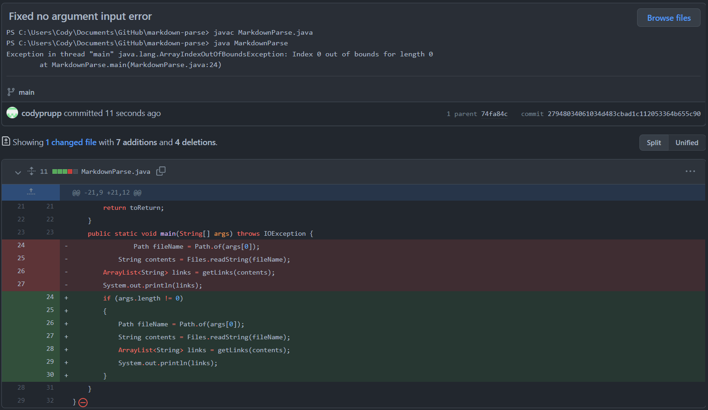
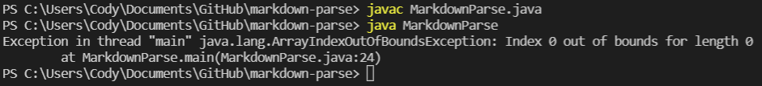
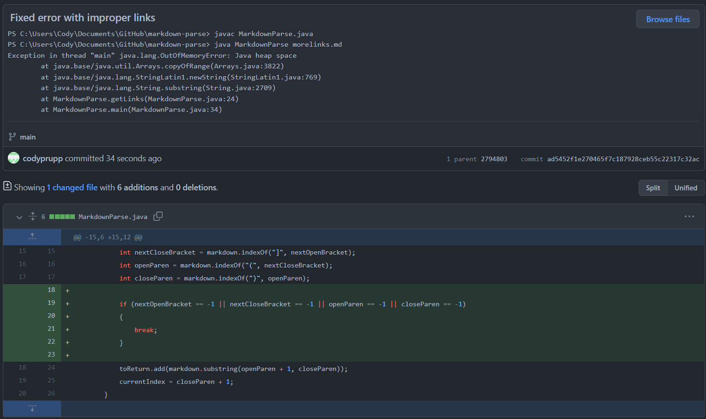
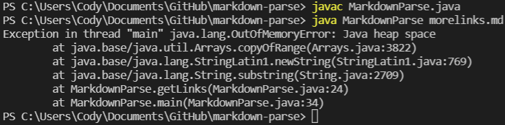
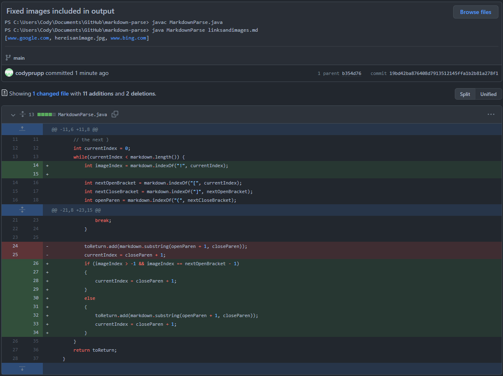
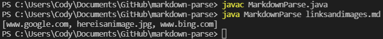

# Lab Report 2 (Week 4)

## Code Change 1: No Argument Input Error

### Code Change Diff Screenshot:

### Link to Test File:
- Since the error occurred when no test file was given as an input, there is no relevant test file to link.

### Symptom:

### Relationship:

- In this case, the bug was that our code assumed that a file would always be used as input. The failure-inducing input was running the program with no arguments in the command line. The symptom that followed was an ArrayIndexOutOfBoundsException, which did not show the exact bug, but did hint at where the problem might have been located.

## Code Change 2: Improper Links Error

### Code Change Diff Screenshot:

### Link to Test File:
- [morelinks.md](https://github.com/codyprupp/markdown-parse/blob/main/morelinks.md)

### Symptom:

### Relationship:

- The bug in our code here was that our while loop endlessly searched for the next set of parenthesis after any set of brackets. The failure-inducing input was any file with a link that contained a set of brackets but no trailing parenthesis. The symptom that followed was a long wait time and eventually a Java heap space error, which did not help to directly find the bug, but gave us a clue that the program might have an infinite loop somewhere.

## Code Change 3: Images Included in Output

### Code Change Diff Screenshot:

### Link to Test File:
- [linksandimages.md](https://github.com/codyprupp/markdown-parse/blob/main/linksandimages.md)

### Symptom:

### Relationship:

- For this case, the bug in our code was that our program would output both links and image filenames, which is not the correct output based on our prompt (it should only include links). The failure-inducing input was any file that contained the markdown code for an image. The symptom that followed was the file name of the image appearing in the output array of our program, which gave our group no helpful information as to where the bug might be as there were no errors in the program.