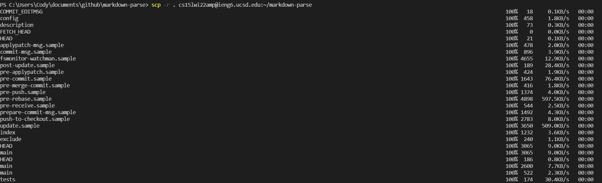
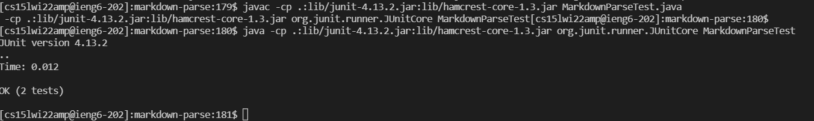
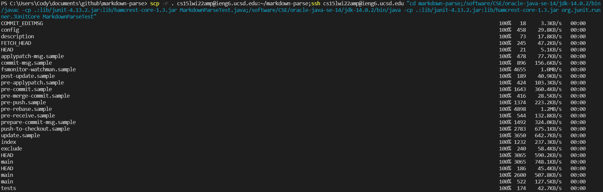
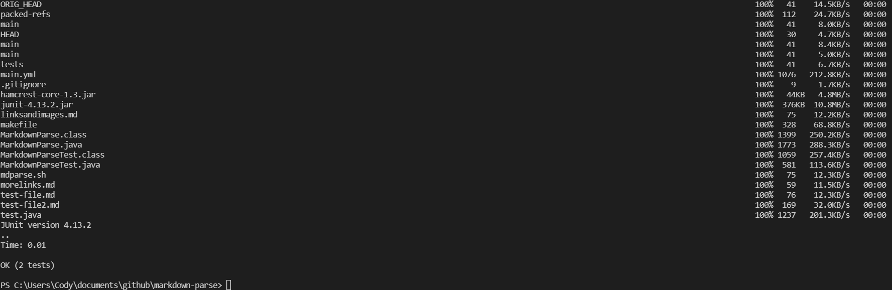

# Lab Report 3 (Week 6)

## Option 3: Copy whole directories with `scp -r`

### Copying the markdown-parse directory onto ieng6

This screenshot shows some of the output from typing the command to copy the markdown-parse directory onto ieng6. Some of the output that wasn't shown includes a long list of files that had "permission denied" when they were copied. This command took about a minute to fully execute the first time, because it got stuck copying a 2 MB file for a while.

### Logging into ieng6, compiling, and running markdown-parse tests

This screenshot shows the output of compiling and running the test file for MarkdownParse.java after logging into ieng6. I had no issues running these commands, and the output was exactly as I expected. Something interesting is that I noticed that there were multiple `lib` directories on ieng6, so I wonder which directory the classpath referenced.

### Combining `scp`, `;`, and `ssh` to copy the whole directory and run the tests in one line

This screenshot shows some of the output from the long command to copy the markdown-parse directory, log into ieng6, compile, run the test file, and log back out. The command is awfully long, so it would probably be better to make a bash script if I were to ever run the command again, now that I know how. Surprisingly, the output of this command took less time to fully complete than when I originally copied the directory. I suspect that this is because the files that I copied were identical to the ones in ieng6 already, so the computer skipped over those files.