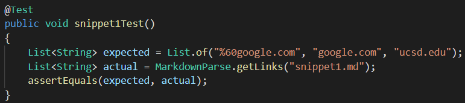
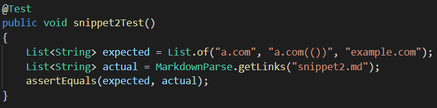
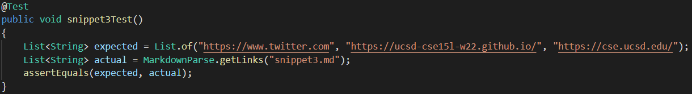
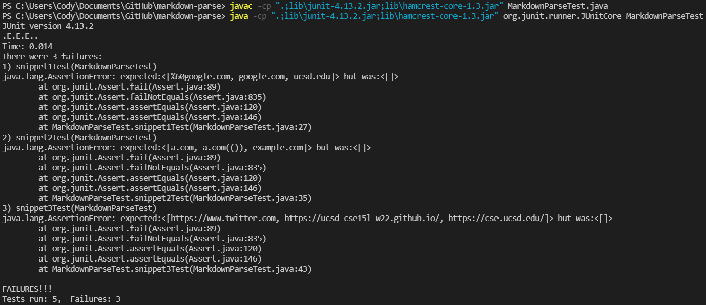
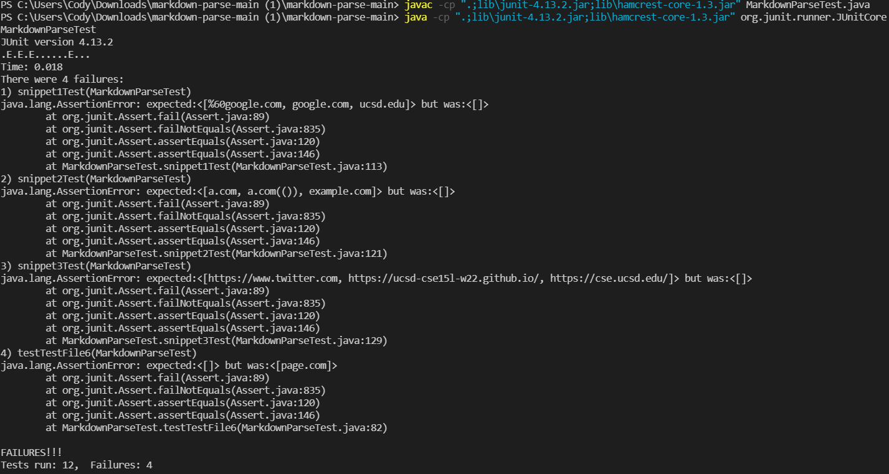

# Lab Report 4 (Week 8)

## [Link to my markdown-parse repository](https://github.com/codyprupp/markdown-parse)

## [Link to the repository I reviewed](https://github.com/Stocktocon/markdown-parse)

#

## Expected Outputs:
- Snippet 1: ["%60google.com", "google.com", "ucsd.edu"]
- Snippet 2: ["a.com", "a.com(())", "example.com"]
- Snippet 3: ["https://www.twitter.com", "https://ucsd-cse15l-w22.github.io/", "https://cse.ucsd.edu/"]

#

## MarkdownParseTest code:
Snippet 1: 

Snippet 2:

Snippet 3:

#

## My Junit Output (no tests passed):

#

## The Junit Output of the repository I reviewed (no tests passed):

#

## Q&A:
Do you think there is a small (<10 lines) code change that will make your program work for snippet 1 and all related cases that use inline code with backticks? If yes, describe the code change. If not, describe why it would be a more involved change.
- Yes, I think there is a small code change that I can make. I should be able to add a variable that checks for the index of the next `, and if the index of the next opening bracket is within two backticks, then ignore those brackets.

Do you think there is a small (<10 lines) code change that will make your program work for snippet 2 and all related cases that nest parentheses, brackets, and escaped brackets? If yes, describe the code change. If not, describe why it would be a more involved change.
- Yes, I think there is a small code change that I can make. I think I can add an int variable that increments at every open bracket and decrements at every close bracket. If the number ever goes above 1, then the outer-most brackets should be ignored, and the inner ones should be treated as the link.

Do you think there is a small (<10 lines) code change that will make your program work for snippet 3 and all related cases that have newlines in brackets and parentheses? If yes, describe the code change. If not, describe why it would be a more involved change.
- I do not think there is a small code change that will make my program work for snippet 3. This is because I would have to deal with line breaks, and I am not sure how to go about that. I think it would involve a for loop checking each line instead of just the index of the next significant symbol.