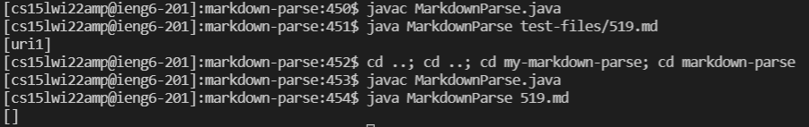
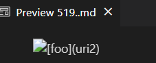
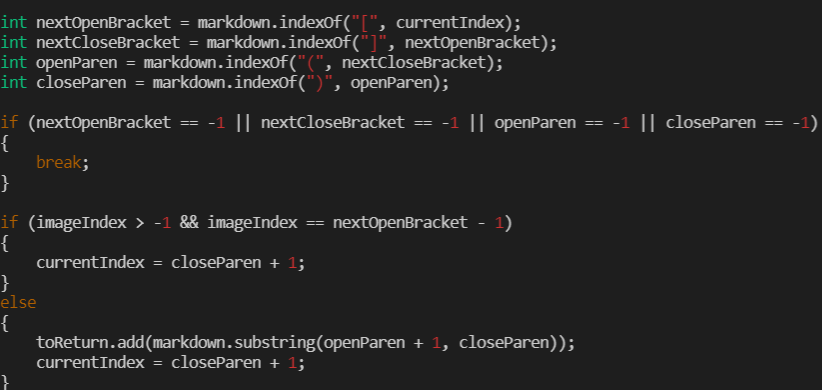
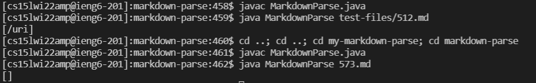
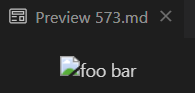
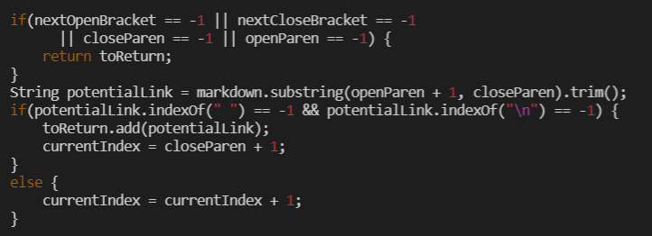

# Lab Report 5 (Week 10)

## Finding tests with different results:

- The way I found the tests with different results was by manually comparing tests with my code and the given markdown-parse code. This was rather inefficient, and I imagine that I could use some sort of for loop to print out the results of each test and compare their strings.

## Test 1

- For this test, I chose commonmark test 519.

### Actual output:

- The first output is the lab 9 implementation; the second is my markdown-parse implementation.

### Expected output:

- Derived from VS Code's markdown preview function

### Correction:

- My program currently doesn't account for when there are multiple brackets and parentheses intertwined in the markdown file. Therefore, the fix should be contained near the lines of code that search for the next opening/closing brackets and parentheses.

## Test 2
- For this test, I chose commonmark test 573

### Actual output:

- The first output is the lab 9 implementation; the second is my markdown-parse implementation.

### Expected output:

- Derived from VS Code's markdown preview function

### Correction:

- This program currently has no code to account for an image, which is not a link. Therefore, the location to fix that would be somewhere around the lines of code to find the next open/close brackets. To fix it, there would have to be some sort of check that the first character before an opening bracket is not an exclamation point.